# Networking

## Tutorials and Guides

### Configure Router Mikrotik Replacing Router HGU Movistar/O2

This guide documents how I configured a MikroTik hEX S as the main router behind a Movistar/O2 HGU. The HGU remains the optical endpoint in `Monopuesto` mode, while the MikroTik terminates PPPoE and provides routing, firewall, DHCP, DNS, and VPN services.

#### Home Network Map

[Open the interactive home network diagram](./home-network.html).

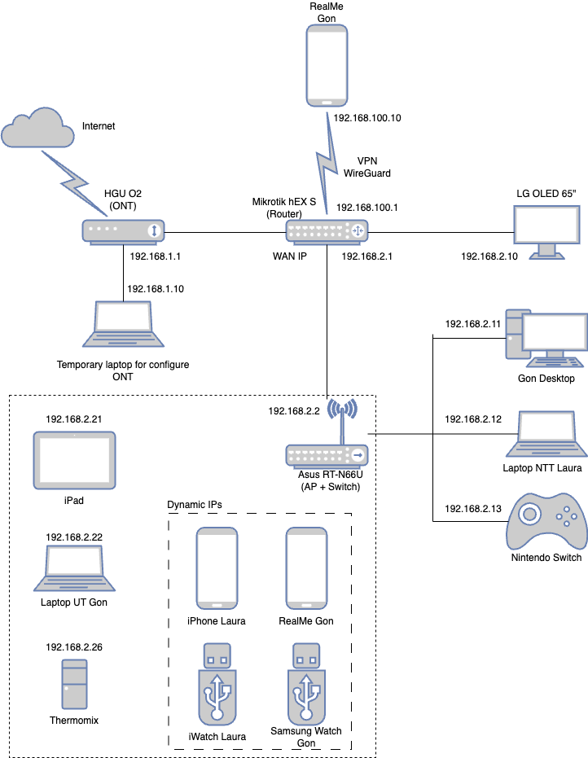

The image above is the original static map. The interactive diagram is a reviewed, source-backed version with guided views for Internet access, LAN services, and WireGuard remote access.

#### Hard Reset

This is optional. I reset the router because it had been configured years earlier and I no longer knew its management subnet or credentials:

1. With the router unplugged, press and hold the **Reset** button, then reconnect the power.
2. Release the button when the green SFP LED starts flashing to reset RouterOS to its defaults. [More info](https://help.mikrotik.com/docs/spaces/UM/pages/18350173/hEX+S#hEXS-Powering)
3. After the router reboots, connect to `192.168.88.1` with user `admin` and no password. Temporarily configure the client with an address in `192.168.88.0/24`, then set a strong router password before continuing.

#### Change default IP address

MikroTik routers can be managed through WinBox, WebFig, or the RouterOS CLI. This guide uses WinBox screenshots and includes equivalent CLI commands.

##### WinBox

- Go to **IP** > **Addresses**
- Select interface with name `bridge`
- Modify **Address** and **Network**. In this case:
  - **Address**: `192.168.2.1/24`
  - **Network**: `192.168.2.0`
- Click on **Apply** and **OK**
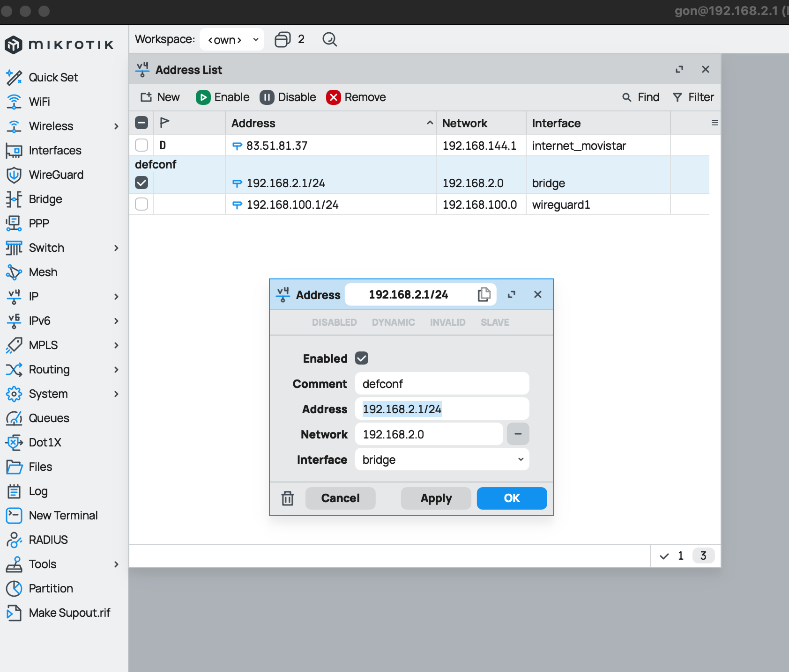
- Go to **System** > **Reboot**

##### CLI

Set the router's LAN address on the `bridge` interface. In this configuration, the existing address entry has ID `0`.

```bash
ip/address/print where interface=bridge
Columns: ADDRESS, NETWORK, INTERFACE
# ADDRESS         NETWORK      INTERFACE
;;; defconf
0 192.168.88.1/24  192.168.88.0  bridge

ip/address/set numbers=0 address=192.168.2.1/24

ip/address/print where interface=bridge
Columns: ADDRESS, NETWORK, INTERFACE
# ADDRESS         NETWORK      INTERFACE
;;; defconf
0 192.168.2.1/24  192.168.2.0  bridge
```

#### Change the HGU to Monopuesto mode

Change the HGU from its default routing mode to `Monopuesto` so the downstream MikroTik can establish the PPPoE session. The HGU still provides the optical termination and its management interface; it is not an unmanaged ONT.

- Open the HGU web panel at [http://192.168.1.1/](http://192.168.1.1/).
- Disable its DHCP service and Wi-Fi.
- Change the mode from **Multipuesto** to **Monopuesto**.
- Connect the HGU's `eth1` port to the MikroTik's `ether1` port.

#### Configure VLAN for a tagged handoff

Movistar/O2 uses VLANs for Internet, VoIP, and TV services; Internet traffic uses VLAN ID `6`. Only create this interface when the handoff to the MikroTik is tagged, such as with a direct ONT. In the captured configuration, `internet_movistar` is running directly on `ether1`, so `vlan_internet_movistar` exists but is not part of the active PPPoE path.

RouterOS recommends keeping the VLAN Layer 3 MTU at `1500`. PPPoE negotiates its own lower effective MTU; the screenshot below shows an older VLAN MTU value of `1492`.

##### WinBox

- Go to **Interfaces** and select the **VLAN** tab.
- Click **New**.
- Set these parameters:
  - **Name**: `vlan_internet_movistar`
  - **MTU**: `1500`
  - **VLAN ID**: `6`
  - **Interface**: `ether1`
- Click **Apply** and **OK**.

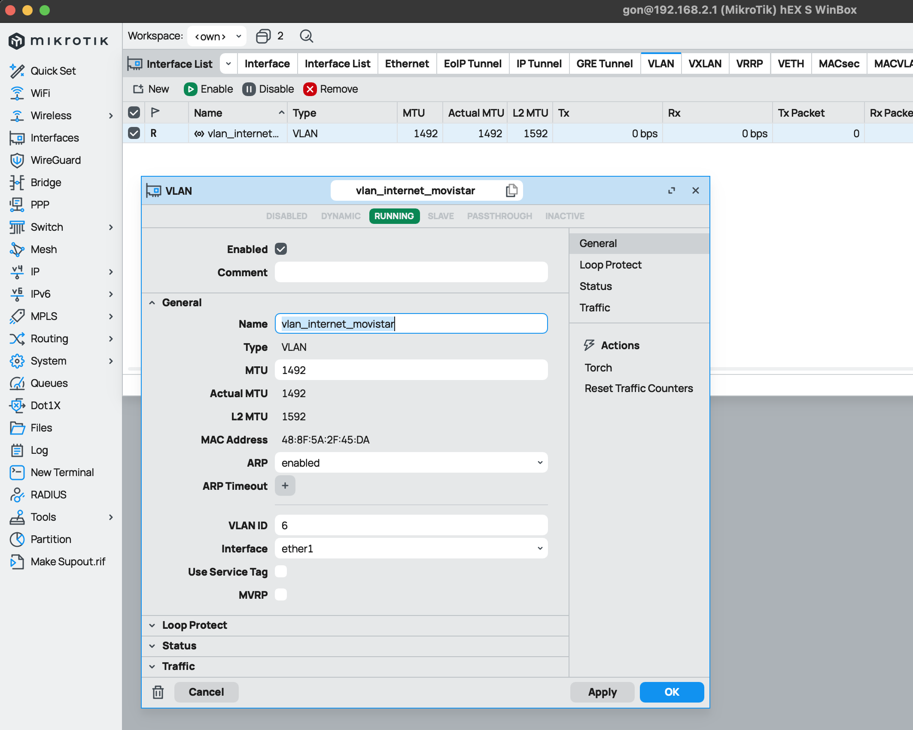

##### CLI

```bash
interface/vlan/add name=vlan_internet_movistar vlan-id=6 interface=ether1


interface/vlan/print
Flags: R - RUNNING
Columns: NAME, MTU, ARP, VLAN-ID, INTERFACE
#   NAME                     MTU  ARP      VLAN-ID  INTERFACE
0 R vlan_internet_movistar  1500  enabled        6  ether1
```

#### Configure PPPoE Client (WAN)

**PPPoE** (Point-to-Point Protocol over Ethernet) establishes the authenticated session with Movistar/O2 and assigns the MikroTik a public IP address.

The captured HGU `Monopuesto` setup exposes untagged PPPoE, so it uses `ether1`. For a tagged handoff, bind the PPPoE client to `vlan_internet_movistar` instead.

##### WinBox

* Go to **PPP** 
* Click on **New** > **PPPoE Client**
* On tab/section **General**:
  - **Name**: `internet_movistar`
  - **Interface**: `ether1`
* On tab/section **Dial Out**:
  - **User**: `adslppp@telefonicanetpa`
  - **Password**: `adslppp`
  - **Enable option** `Add Default Route`
* Click on **Apply** and **OK**
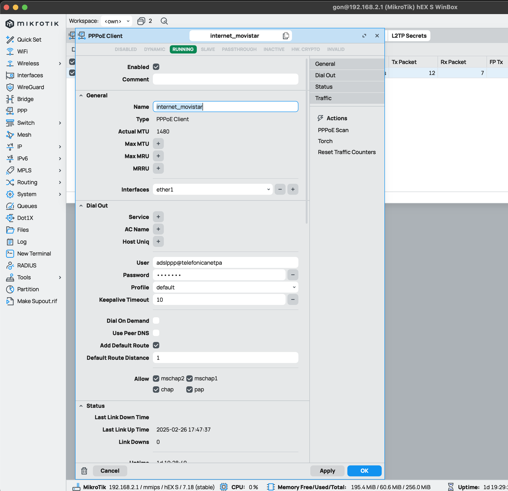

##### CLI

```bash
interface/pppoe-client/add name=internet_movistar interface=ether1 user=adslppp@telefonicanetpa password=adslppp add-default-route=yes disabled=no


interface/pppoe-client/print
Flags: X - disabled, I - invalid; R - running
 0  R name="internet_movistar" max-mtu=auto max-mru=auto mrru=disabled interface=ether1 user="adslppp@telefonicanetpa"
      password="adslppp" profile=default keepalive-timeout=10 service-name="" ac-name="" add-default-route=yes
      default-route-distance=1 dial-on-demand=no use-peer-dns=no allow=pap,chap,mschap1,mschap2
```

#### Configure DHCP Server on LAN

Configure the address range that the MikroTik DHCP server leases to LAN clients. The default DHCP server runs on the `bridge` interface.

The original map labels `192.168.2.10` through `192.168.2.26` as fixed client addresses, while the captured pool starts at `192.168.2.10`. The steps below use a non-overlapping dynamic range. Alternatively, keep the original range and convert every labelled client address to a static DHCP lease.

##### WinBox

* Go to **IP** > **DHCP Server**
* Select tab **Networks** and select network with name `defconf`:
  - **Address**: `192.168.2.0/24`
  - **Gateway**: `192.168.2.1`
  - **DNS servers**: `192.168.2.1`
* Click on **Apply** and **OK**

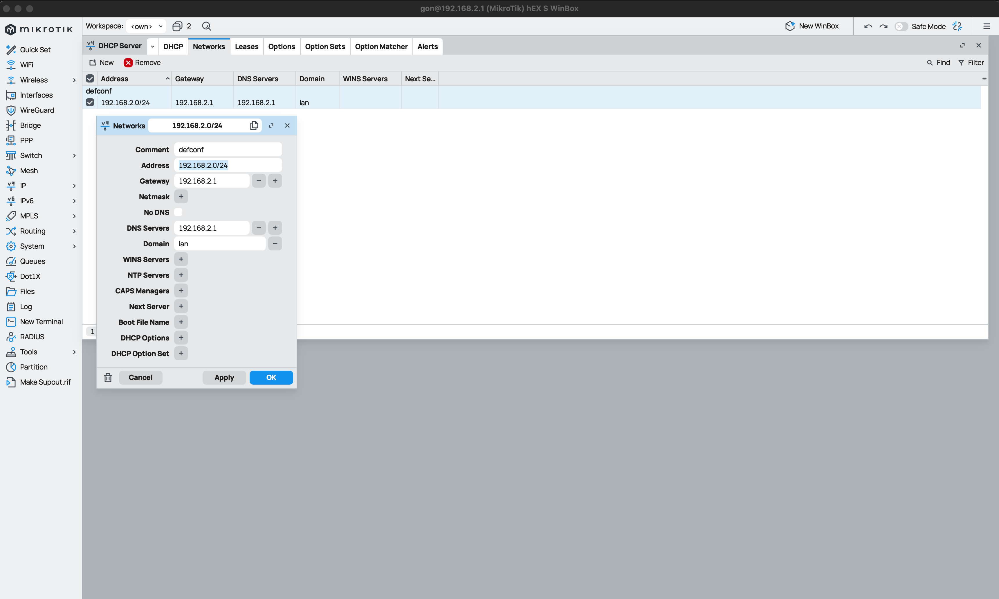

* Go to **IP** > **Pool**
* Select IP pool named `dhcp-default`:
  - **Address**: `192.168.2.100-192.168.2.254`
* Click on **Apply** and **OK**

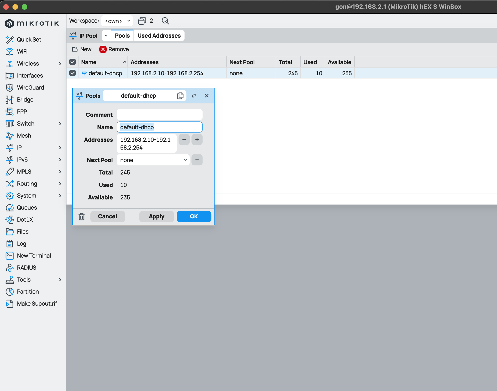

The screenshot records the previous `192.168.2.10-192.168.2.254` pool.

##### CLI

```bash
ip/dhcp-server/network/set numbers=0 address=192.168.2.0/24 gateway=192.168.2.1 dns-server=192.168.2.1


ip/dhcp-server/network/print
Columns: ADDRESS, GATEWAY, DNS-SERVER
# ADDRESS         GATEWAY      DNS-SERVER
;;; defconf
0 192.168.2.0/24  192.168.2.1  192.168.2.1

ip/pool/set numbers=0 ranges=192.168.2.100-192.168.2.254

ip/pool/print
Columns: NAME, RANGES, TOTAL, USED, AVAILABLE
#  NAME          RANGES                        TOTAL  USED  AVAILABLE
0  default-dhcp  192.168.2.100-192.168.2.254    155     0        155
```

#### Configure NAT on Firewall

Check that a source NAT masquerade rule exists for traffic leaving through the `WAN` interface list.

##### WinBox

* Go to **IP** > **Firewall**
* Select tab **NAT**
* Check if a rule exists with next config:
  * On **General**
    * **Chain**: `srcnat`
    * **Out. Interface List**: `WAN`
  * On **Action**
    * **Action**: `masquerade`
  * Checkbox **Enabled** marked

If it does not exist, create it with this configuration.
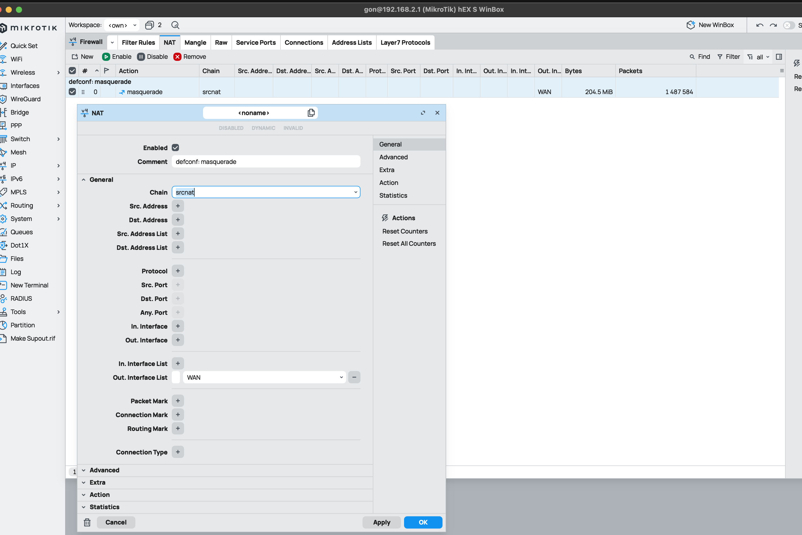
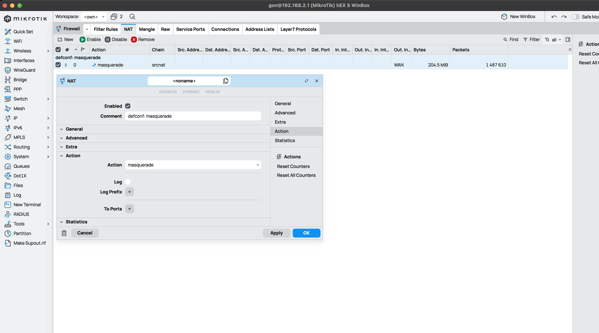

##### CLI

```bash
ip/firewall/nat/add chain=srcnat action=masquerade out-interface-list=WAN comment="defconf:masquerade"


ip/firewall/nat/print
Flags: X - disabled, I - invalid; D - dynamic
 0    ;;; defconf: masquerade
      chain=srcnat action=masquerade out-interface-list=WAN ipsec-policy=out,none
```

#### Configure DNS Server

Configure the MikroTik as a caching DNS server for known LAN clients.

##### WinBox

Configure DNS server

* Go to **IP** > **DNS**
  * On **Servers** add next DNS servers:
    * `1.1.1.1`
    * `1.0.0.1`
    * `8.8.8.8`
    * `8.8.4.4`
  * Check option **Allow Remote Requests**
  * **Cache Max TTL**: `06:00:00` (Optional)
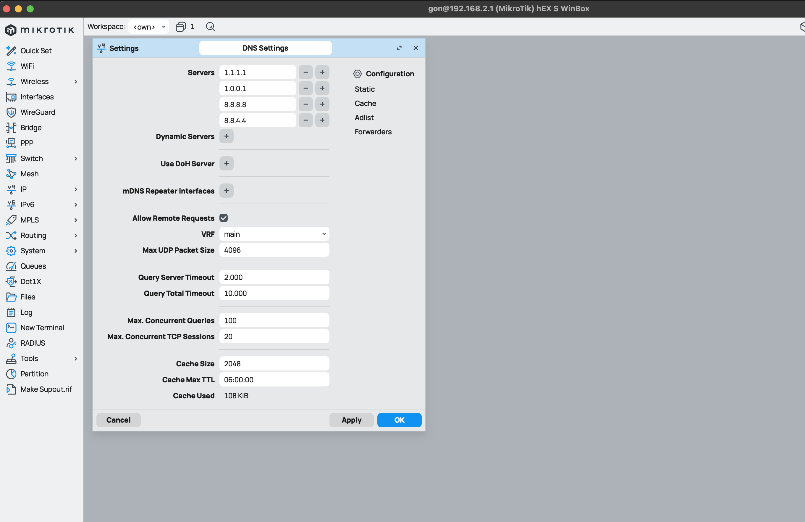

Add firewall rules for DNS requests. Restrict both rules to the LAN; `allow-remote-requests=yes` without a source restriction can expose the router as an open resolver.

- Go to **IP** > **Firewall**.
- Check or add rules allowing DNS traffic over TCP and UDP:
  - Click **New**:
    - **Chain**: `input`
    - **In. Interface List**: `LAN`
    - **Protocol**: `tcp`
    - **Dst. Port**: `53`
    - **Action**: `accept`
  - Click **Apply** and **OK**.
  - Create an equivalent rule with **Protocol** set to `udp`.
  - Place both rules after the ICMP allow rule and before the rule that drops input not coming from the LAN.
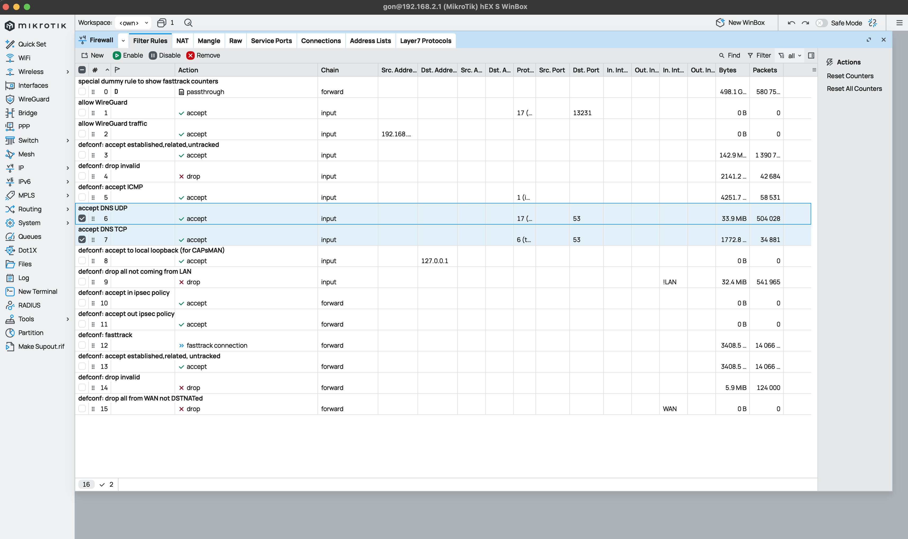

The screenshot shows the earlier rules without an input-interface restriction. Do not reproduce that part of the captured configuration. If WireGuard clients should also use this resolver, add equivalent rules limited to `src-address=192.168.100.0/24`.

Configure DNS by DHCP clients

* Go to **IP** > **DHCP Server**
* Go to tab **Networks**
* Select network `defconf`
  * **DNS Servers**: `192.168.2.1` (Mikrotik local IP)
  * **Domain**: `lan`
* Click on **Apply** and **OK**
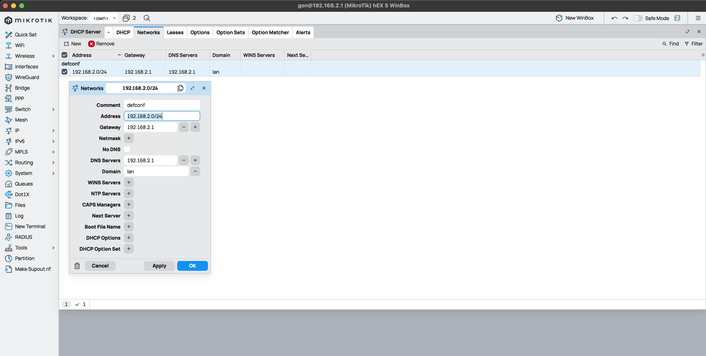

##### CLI

```bash
ip/firewall/filter/add chain=input action=accept in-interface-list=LAN protocol=udp dst-port=53 comment="allow LAN DNS over UDP" place-before=[find where comment="defconf: drop all not coming from LAN"]
ip/firewall/filter/add chain=input action=accept in-interface-list=LAN protocol=tcp dst-port=53 comment="allow LAN DNS over TCP" place-before=[find where comment="defconf: drop all not coming from LAN"]

ip/dns/set servers="1.1.1.1,1.0.0.1,8.8.8.8,8.8.4.4" allow-remote-requests=yes cache-max-ttl=6h


ip/dns/print
                      servers: 1.1.1.1
                               1.0.0.1
                               8.8.8.8
                               8.8.4.4
              dynamic-servers:
               use-doh-server:
              verify-doh-cert: no
   doh-max-server-connections: 5
   doh-max-concurrent-queries: 50
                  doh-timeout: 5s
        allow-remote-requests: yes
          max-udp-packet-size: 4096
         query-server-timeout: 2s
          query-total-timeout: 10s
       max-concurrent-queries: 100
  max-concurrent-tcp-sessions: 20
                   cache-size: 2048KiB
                cache-max-ttl: 6h
      address-list-extra-time: 0s
                          vrf: main
           mdns-repeat-ifaces:
                   cache-used: 120KiB

```

#### Configure WireGuard VPN

MikroTik supports WireGuard from RouterOS **7.1** onward. Upgrade RouterOS first if the installed version is older.

This example connects a phone to the MikroTik, but the same approach works with any WireGuard-compatible client.

This video was a useful reference:
[Configurar VPN Wireguard - Mikrotik en tu telefono](https://www.youtube.com/watch?v=x409B6SO3as)

##### WinBox

Create the WireGuard interface:

* Go to **WireGuard** > **New**
* On tab **General**:
  * **Name**: `wireguard1`
  * **Listen Port**: `13231`
  * **MTU**: `1420`
  * Click **Apply**. RouterOS generates the private and public keys.
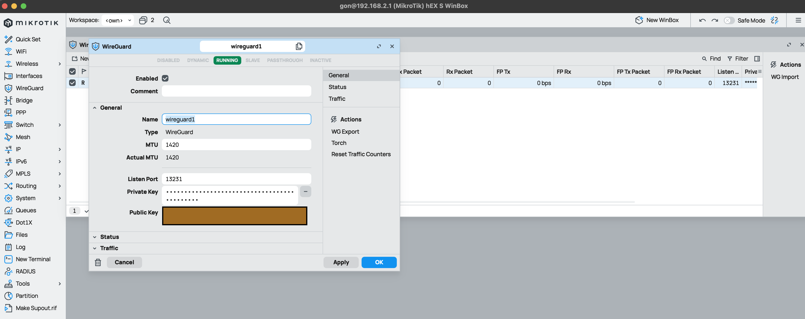

Assign an IP address to the new interface:

* Go to **IP** > **Addresses** > **New**
* Configure these parameters:
  * **Enabled**: marked
  * **Address**: `192.168.100.1/24`
  * **Network**: `192.168.100.0`
  * **Interface**: `wireguard1`

Create a peer on the server. This example uses a mobile phone whose WireGuard address is `192.168.100.10/32`.

* Go to **WireGuard**
* On tab **Peers** > **New**
  * **Enabled**: marked
  * **Name**: `realme_gon`
  * **Interface**: `wireguard1`
  * **Public Key**: `<public key generated by the WireGuard client>`
  * **Allowed Address**: `192.168.100.10/32`

The server also needs a WAN input rule for UDP port `13231` and a forward rule from the WireGuard subnet to the home LAN. Place both before the relevant drop rules:

```bash
ip/firewall/filter/add chain=input action=accept in-interface-list=WAN protocol=udp dst-port=13231 comment="allow WireGuard" place-before=[find where comment="defconf: drop all not coming from LAN"]
ip/firewall/filter/add chain=forward action=accept src-address=192.168.100.0/24 dst-address=192.168.2.0/24 comment="allow WireGuard to LAN" place-before=[find where comment="defconf: fasttrack"]
```

On the phone, configure its tunnel address as `192.168.100.10/32`, use the MikroTik's WireGuard public key, set the endpoint to the router's public IP or DNS name on UDP port `13231`, and include `192.168.2.0/24` in `AllowedIPs`. Use `192.168.2.1` as DNS only after adding the VPN-specific DNS firewall rules described above.
