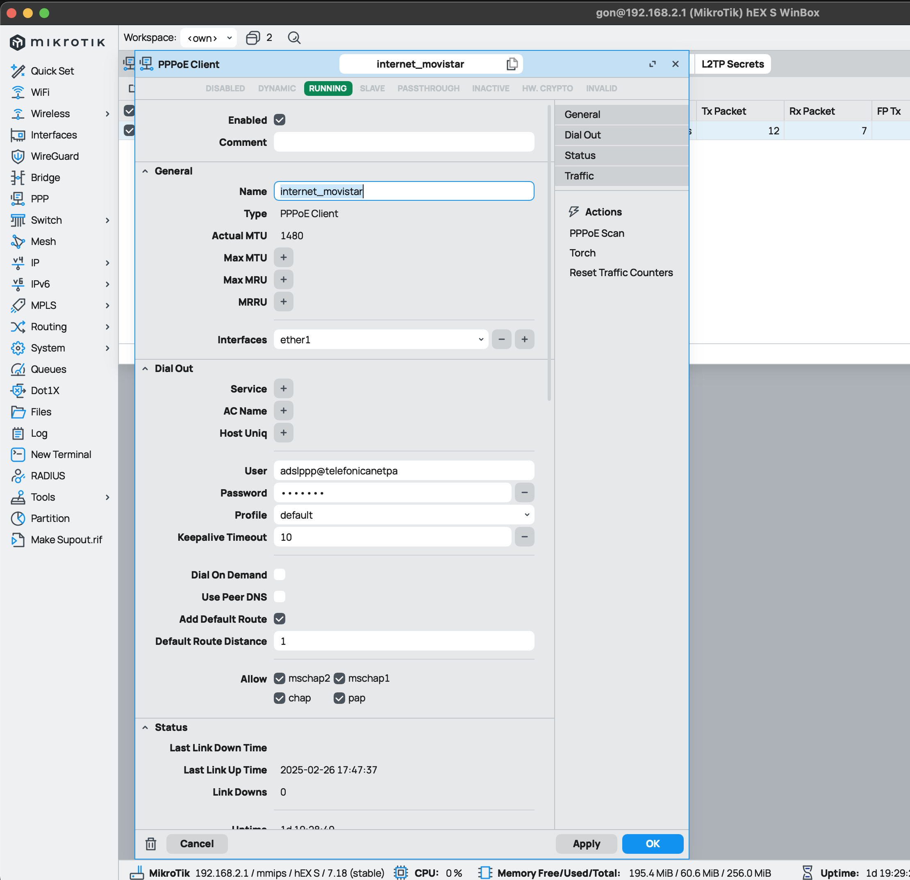
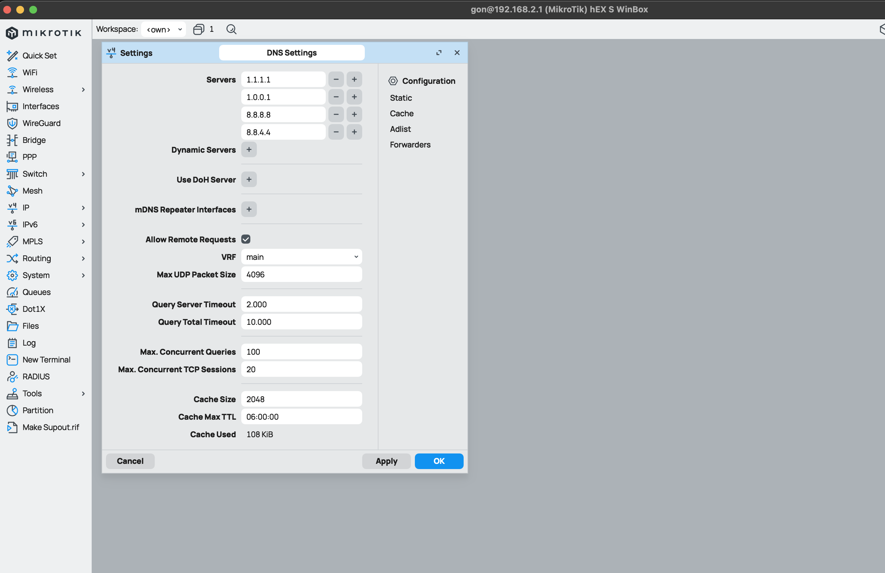

# Networking

## Tutorials and Guides

### Configure Router Mikrotik Replacing Router HGU Movistar/O2

This guide explains different steps for configure my router Miktrotik hEX S replacing Movistar/O2 router HGU. this one will be used as ONT only.

#### Home Network Map


This is the network map which I configured following this guide.

#### Hard Reset

This is optional. I did it because I configured this router years ago and I didn't remember which CIDR I've configured and credentials for login on it:

1. With unplugged router, press "Reset" button and plug it again.
2. Release the button when green SFP LED starts flashing to reset RouterOS configuration to defaults. [More info](https://help.mikrotik.com/docs/spaces/UM/pages/18350173/hEX+S#hEXS-Powering)
3. After router reboots, I can access to router config with IP `192.168.88.1` and credentials `username: admin` and no password. We need to modify our IP and set another inside CIDR `192.168.88.0/24`

#### Change default IP address

Before start to configure anything, ust to reminder that we can manage a mikrotik router with a GUI like WinBox o WebFig, or using a command line terminal.
I recommend to use WinBox but I added CLI commands for apply same config just doing copy-paste.

##### WinBox

- Go to **IP** > **Addresses**
- Select interface with name `bridge`
- Modify **Address** and **Network**. In this case:
  - **Address**: `192.168.2.1/24`
  - **Network**: `192.168.2.0`
- Click on **Apply** and **OK**

- Go to **System** > **Reboot**

##### CLI

Setting up a new Default IP for router on `bridge` interface using its id which is `0`

```bash
ip/address/print where interface=bridge
Columns: ADDRESS, NETWORK, INTERFACE
# ADDRESS         NETWORK      INTERFACE
;;; defconf
0 192.168.88.1/24  192.168.88.0  bridge

ip/address/set numbers=0 address=192.168.2.1/24

ip/address/print where interface=bridge
Columns: ADDRESS, NETWORK, INTERFACE
# ADDRESS         NETWORK      INTERFACE
;;; defconf
0 192.168.2.1/24  192.168.2.0  bridge
```

#### Change HGU mode to bridge

We need to change how our Movistar/O2 HGU router is working. At the moment is working as ONT + Router. We want to change it its mode to just working as ONT.

* Connect to HGU web panel http://192.168.1.1/
* Disable DHCP service and Wi-Fi
* Change mode form "**Multipuesto**" to "**Monopuesto**"
* Connect cable from `eth1`port of this router to `eth1`port of Mikrotik router

#### Configure VLAN

Movistar/O2 uses VLANs for offer data traffic, VoIP and TV services. We just need data traffic which its VLAN ID is `6`

##### WinBox

* Go to **Interfaces** > Select tab **VLAN**
* Click on **New**
* Set next parameters/config:
  - **Name**: `vlan_internet_movistar`
  - **MTU**: `1492`
  - **VLAN ID**: `6`
  - **Interface**: `ether1`
* Click on **Apply** and **OK**


##### CLI

```bash
interface/vlan/add name=vlan_internet_movistar mtu=1492 vlan-id=6 interface=ether1


interface/vlan/print
Flags: R - RUNNING
Columns: NAME, MTU, ARP, VLAN-ID, INTERFACE
#   NAME                     MTU  ARP      VLAN-ID  INTERFACE
0 R vlan_internet_movistar  1492  enabled        6  ether1
```

#### Configure PPPoE Client (WAN)

**PPPoE** (Point-to-Point Protocol over Ethernet) is used by many ISP, Movistar/O2 too. Configuring our Mikrotik with PPPoE we're establishing an individual and authenticed session with Movistar, which will provide me a publick IP address.

##### WinBox

* Go to **PPP** 
* Click on **New** > **PPPoE Client**
* On tab/section **General**:
  - **Name**: `internet_movistar`
  - **Interface**: `ether1`
* On tab/section **Dial Out**:
  - **User**: `adslppp@telefonicanetpa`
  - **Password**: `adslppp`
  - **Enable option** `Add Default Route`
* Click on **Apply** and **OK**


##### CLI

```bash
interface/pppoe-client/add name=internet_movistar interface=ether1 user=adslppp@telefonicanetpa password=adslppp add-default-route=yes disabled=no


interface/pppoe-client/print
Flags: X - disabled, I - invalid; R - running
 0  R name="internet_movistar" max-mtu=auto max-mru=auto mrru=disabled interface=ether1 user="adslppp@telefonicanetpa>
      password="adslppp" profile=default keepalive-timeout=10 service-name="" ac-name="" add-default-route=yes
      default-route-distance=1 dial-on-demand=no use-peer-dns=no allow=pap,chap,mschap1,mschap2
```

#### Configure DHCP Server on LAN

Configure DHCP range IP which router Mikrotik will lease to different hosts. Mikrotik offer a DHCP Server configured on virtual interface `bridge`.
I just want to set range IP.

##### WinBox

* Go to **IP** > **DHCP Server**
* Select tab **Networks** and select network with name `defconf`:
  - **Address**: `192.168.2.0/24`
  - **Gateway**: `192.168.2.1`
  - **DNS servers**: `192.168.2.1`
* Click on **Apply** and **OK**


* Go to **IP** > **Pool**
* Select IP pool named `dhcp-default`:
  - **Address**: `192.168.2.10-192.168.2.254`
* Click on **Apply** and **OK**


##### CLI

```bash
ip/dhcp-server/network/set numbers=0 address=192.168.2.0/24 gateway=192.168.2.1 dns-server=192.168.2.1


ip/dhcp-server/network/print
Columns: ADDRESS, GATEWAY, DNS-SERVER
# ADDRESS         GATEWAY      DNS-SERVER
;;; defconf
0 192.168.2.0/24  192.168.2.1  192.168.2.1

ip/pool/set numbers=0 ranges=192.168.2.10-192.168.2.254

ip/pool/print
Columns: NAME, RANGES, TOTAL, USED, AVAILABLE
#  NAME          RANGES                      TOTAL  USED  AVAILABLE
0  default-dhcp  192.168.2.10-192.168.2.254    245     8        237
```

#### Configure NAT on Firewall

Just check if a NAT rule for Masquerade is configured

##### WinBox

* Go to **IP** > **Firewall**
* Select tab **NAT**
* Check if a rule exists with next config:
  * On **General**
    * **Chain**: `srcnat`
    * **Out. Interface List**: `WAN`
  * On **Action**
    * **Action**: `masquerade`
  * Checkbox **Enabled** marked

If not exists, creates a new one with this config.


##### CLI

```bash
ip/firewall/nat/add chain=srcnat action=masquerade out-interface=WAN comment="defconf:masquerade"


ip/firewall/nat/print
Flags: X - disabled, I - invalid; D - dynamic
 0    ;;; defconf: masquerade
      chain=srcnat action=masquerade out-interface-list=WAN ipsec-policy=out,none
```

#### Configure DNS Server

Configure router Mikrotik as DNS server

##### WinBox

Configure DNS server

* Go to **IP** > **DNS**
  * On **Servers** add next DNS servers:
    * `1.1.1.1`
    * `1.0.0.1`
    * `8.8.8.8`
    * `8.8.4.4`
  * Check option **Allow Remote Requests**
  * **Cache Max TTL**: `06:00:00` (Optional)


Add Firewall rules for DNS requests

* Go to **IP** > **Firewall**
* Check or Add a rule allowing DNS traffic for TCP and UDP
  * Click on **New**:
    * **Chain**: `input`
    * **Protocol**: `tcp`
    * **Dst. Port**: `53`
    * **Action**: `accept`
  * Click on **Apply** and **OK**
  * Click on **New**:
    * **Chain**: `input`
    * **Protocol**: `udp`
    * **Dst. Port**: `53`
    * **Action**: `accept`
  * Click on **Apply** and **OK**
  * Check both new rules are after rule allowing ICMP requests


Configure DNS by DHCP clients

* Go to **IP** > **DHCP Server**
* Go to tab **Networks**
* Select network `defconf`
  * **DNS Servers**: `192.168.2.1` (Mikrotik local IP)
  * **Domain**: `lan`
* Click on **Apply** and **OK**


##### CLI

```bash
ip/dns/set servers="1.1.1.1,1.0.0.1,8.8.8.8,8.8.4.4" allow-remote-requests=yes cache-max-ttl=6h


ip/dns/print

ip/dns/print
                      servers: 1.1.1.1
                               1.0.0.1
                               8.8.8.8
                               8.8.4.4
              dynamic-servers:
               use-doh-server:
              verify-doh-cert: no
   doh-max-server-connections: 5
   doh-max-concurrent-queries: 50
                  doh-timeout: 5s
        allow-remote-requests: yes
          max-udp-packet-size: 4096
         query-server-timeout: 2s
          query-total-timeout: 10s
       max-concurrent-queries: 100
  max-concurrent-tcp-sessions: 20
                   cache-size: 2048KiB
                cache-max-ttl: 6h
      address-list-extra-time: 0s
                          vrf: main
           mdns-repeat-ifaces:
                   cache-used: 120KiB

```

#### Configure WireGuard VPN

Mikrotik supports WireGuard VPNs since RouterOS version **7.1**, so we need to upgrade RouterOS before if our version is older.
In this case, we configure a VPN connection between router Mikrotik and my Smart PHone but it could be configure with any device which supports WireGuard.

This video help me a lot:
[Configurar VPN Wireguard - Mikrotik en tu telefono](https://www.youtube.com/watch?v=x409B6SO3as)

##### WinBox

Starting configure a VPN WireGuard server.

* Go to **WireGuard** > **New**
* On tab **General**:
  * **Name**: `wireguard1`
  * **Listen Port**: `13231`
  * **MTU**: `1420`
  * Click on **Apply** and **Private Key** and **Private Key** will be generated randomly 


Create Addres IP for new interface

* Go to **IP** > **Addresses** > **New**
* Configure next parameters:
  * **Enabled**: marked
  * **Address**:`192.168.100.1/24`
  * **Network**: `192.189.100.0`
  * **Interface**: `wireguard1`

Create Peers on server.
In this case I created a peer for my mobile phone, so I've created a peer on my mobile phone. 

* Go to **WireGuard**
* On tab **Peers** > **New**
  * **Enabled**: marked
  * **Name**: `realme_gon`
  * **interface**: `wireguard1`
  * **Public Key**: `<Public Key client created on my mobile phoen when I created a peer there>`
  * **Allowed Address**: `192.168.100.10/32` This IP I assigned on my phone when I created a peer there
